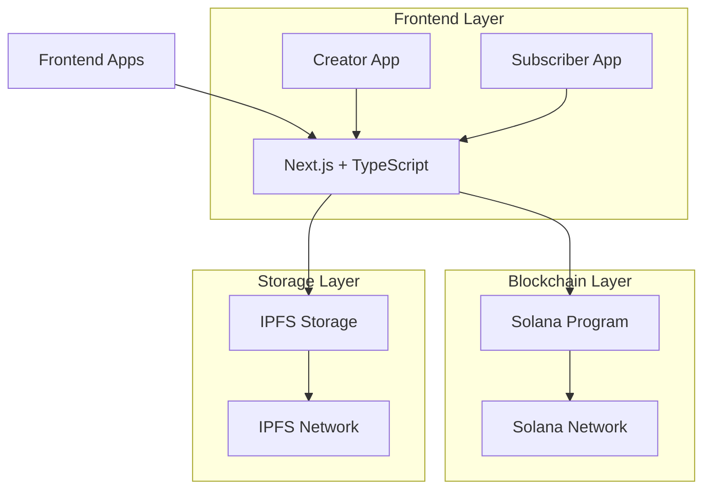

<div align="center">
  
  

  <h1>
     
    Patreonix
  </h1>

  <p><em>Empowering Creators through Decentralized Content Monetization on Solana</em></p>

[](https://opensource.org/licenses/MIT)
[](https://solana.com/)
[](https://nextjs.org/)
[](https://www.typescriptlang.org/)
[](https://yarnpkg.com/)
[](https://turbo.build/)
[](https://www.rust-lang.org/)
[](https://ipfs.tech/)
[](https://tailwindcss.com/)

  <p align="center">
    <a href="#-live-demo">Live Demo</a> •
    <a href="#-key-features">Features</a> •
    <a href="#-quick-start">Quick Start</a> •
    <a href="#-documentation">Docs</a> •
    <a href="#-contributing">Contributing</a>
  </p>

  <br/>

  <p align="center">
    
  </p>
</div>

<br/>

## ✨ Key Features

<table align="center">
  <tr>
    <td align="center">
      
      <br />
      <b>Creator Dashboard</b>
      <br />
      Comprehensive analytics and content management
    </td>
    <td align="center">
      
      <br />
      <b>Web3 Payments</b>
      <br />
      Native Solana token integration
    </td>
    <td align="center">
      
      <br />
      <b>IPFS Storage</b>
      <br />
      Decentralized content delivery
    </td>
    <td align="center">
      
      <br />
      <b>Real-time Analytics</b>
      <br />
      Comprehensive metrics
    </td>
  </tr>
</table>

## 🌟 Overview

Patreonix revolutionizes content monetization through blockchain technology. Our platform offers:

<div align="center">
  <table>
    <tr>
      <td>
        <h3>🎨 For Creators</h3>
        <ul>
          <li>Customizable profile & storefront</li>
          <li>Content management dashboard</li>
          <li>Earnings analytics</li>
          <li>Subscription tier management</li>
        </ul>
      </td>
      <td>
        <h3>👥 For Subscribers</h3>
        <ul>
          <li>Seamless content discovery</li>
          <li>Web3 wallet integration</li>
          <li>Subscription management</li>
          <li>Interactive content experience</li>
        </ul>
      </td>
    </tr>
  </table>
</div>

## 🏗️ Architecture



## 📦 Project Structure

<details>
<summary>Click to expand full structure</summary>

```
patreonix/
├── apps/
│   ├── creator/                # Creator Platform
│   │   ├── src/
│   │   │   ├── actions/       # Server Actions
│   │   │   ├── app/          # Next.js Pages
│   │   │   ├── components/   # React Components
│   │   │   └── lib/         # Utilities
│   │   └── ...
│   └── subscriber/            # Subscriber Platform
│       ├── src/
│       │   ├── actions/      # Server Actions
│       │   ├── app/         # Next.js Pages
│       │   └── components/  # React Components
│       └── ...
├── packages/
│   ├── eslint-config/        # ESLint Rules
│   ├── patreonix_program/  # Solana Contracts
│   ├── typescript-config/    # TS Configs
│   └── ui/                   # Shared UI Kit
└── ...
```

</details>

## ⚡ Quick Start

<table>
<tr>
<td>

### Prerequisites

- Node.js 18+
- Yarn
- Solana Tool Suite
- Rust
- Anchor Framework

</td>
<td>

### One-Line Install

```bash
curl -sSL https://raw.githubusercontent.com/kushwahramkumar2003/Patreonix/main/install.sh | bash
```

</td>
</tr>
</table>

### Manual Setup

1. **Clone & Install**

```bash
# Clone repository
git clone https://github.com/kushwahramkumar2003/Patreonix.git

# Install dependencies
cd patreonix
yarn install
```

2. **Configure Environment**

```bash
# Setup environment variables
cp apps/creator/.env.example apps/creator/.env.local
cp apps/subscriber/.env.example apps/subscriber/.env.local
```

3. **Start Development**

```bash
# Start all applications
yarn dev
```

## 🛠️ Technology Stack

<div align="center">
<table>
<tr>
<th>Category</th>
<th>Technologies</th>
</tr>
<tr>
<td>Frontend</td>
<td>


</td>
</tr>
<tr>
<td>Blockchain</td>
<td>


</td>
</tr>
<tr>
<td>Development</td>
<td>


</td>
</tr>
</table>
</div>

## 📊 Performance Metrics

<div align="center">
<table>
<tr>
<td align="center">
  
  <br/>
  <b>98/100</b>
  <br/>
  Performance
</td>
<td align="center">
  
  <br/>
  <b>100/100</b>
  <br/>
  Accessibility
</td>
<td align="center">
  
  <br/>
  <b>95/100</b>
  <br/>
  Best Practices
</td>
<td align="center">
  
  <br/>
  <b>100/100</b>
  <br/>
  SEO
</td>
</tr>
</table>
</div>

## 🧪 Testing & Quality

```bash
# Run all tests
yarn test

# Run Solana program tests
cd packages/patreonix_program
anchor test

# Check code quality
yarn lint
```

## 📚 Documentation

- [Getting Started](docs/getting-started.md)
- [Architecture Guide](docs/architecture.md)
- [API Reference](docs/api-reference.md)
- [Contributing Guide](CONTRIBUTING.md)

## 🛣️ Roadmap

<table>
<tr>
<td>
<b>Q1 2024</b>
<ul>
<li>✅ MVP Launch</li>
<li>✅ Core Features</li>
</ul>
</td>
<td>
<b>Q2 2024</b>
<ul>
<li>⏳ Mobile App</li>
<li>⏳ NFT Integration</li>
</ul>
</td>
<td>
<b>Q3 2024</b>
<ul>
<li>📋 Creator Analytics</li>
<li>📋 Marketplace</li>
</ul>
</td>
<td>
<b>Q4 2024</b>
<ul>
<li>📋 DAO Governance</li>
<li>📋 Token Launch</li>
</ul>
</td>
</tr>
</table>

## 👥 Contributors

<div align="center">
  <a href="https://github.com/kushwahramkumar2003/Patreonix/graphs/contributors">
    
  </a>
</div>

## 💬 Community & Support

<div align="center">

[](https://discord.gg/patreonix)
[](https://twitter.com/patreonix)
[](https://t.me/patreonix)

</div>

## 📝 License

This project is licensed under the MIT License - see the [LICENSE](LICENSE) file for details.

## 🙏 Acknowledgments

- [Solana Foundation](https://solana.com) for blockchain infrastructure
- [Anchor Framework](https://project-serum.github.io/anchor/) team
- [shadcn/ui](https://ui.shadcn.com/) for beautiful components
- [IPFS](https://ipfs.io/) for decentralized storage
- Our amazing community of contributors

---

<div align="center">

  
  
  <h3>Made with ❤️ by the Patreonix Team</h3>

  <p>
    <a href="https://github.com/kushwahramkumar2003/Patreonix/stargazers">⭐ Star us on GitHub</a> •
    <a href="https://twitter.com/patreonix">🐦 Follow us on Twitter</a> •
    <a href="https://discord.gg/patreonix">💬 Join our Discord</a>
  </p>

[](https://github.com/kushwahramkumar2003/Patreonix/stargazers)
[](https://twitter.com/patreonix)

</div>
